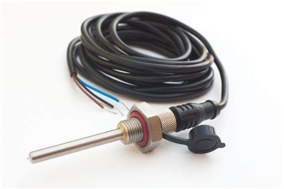

```{r setup, include=FALSE}
knitr::opts_chunk$set(echo = TRUE)
library(tidyverse)
library(DT)
library(rnaturalearth)
library(mapview)
source("Localisation_sondes.R")

```

```{r image,echo=FALSE}

```

## Introduction
ci dessous un document de lavorisation des sondes thermiques en continu équipées sur les stations
Hydrométriques de la DREAL

# Localisation des sondes

```{r Localisation,echo=FALSE}
temp <- Localisation_sondes()
sites <- temp[[1]] 

sondes <- temp[[2]]
#fonds de carte bretagne
Bretagne <- ne_states(country = "France", returnclass = "sf") %>% 
  filter(region=="Bretagne")

mapview(Bretagne,zcol='name',legend=FALSE,label=FALSE,alpha.regions=0.5,popup=FALSE)+
   mapview(sites,layer.name = "sites hydrométrie",popup=leafpop::popupTable(sites,zcol=c('code_station','libelle_site')),cex=4,col.regions='blue')+
  mapview(sondes,layer.name = "sondes thermiques",popup=leafpop::popupTable(sondes,zcol=c('code_station','libelle_site')),cex=6,col.regions='red')
 
  

```

